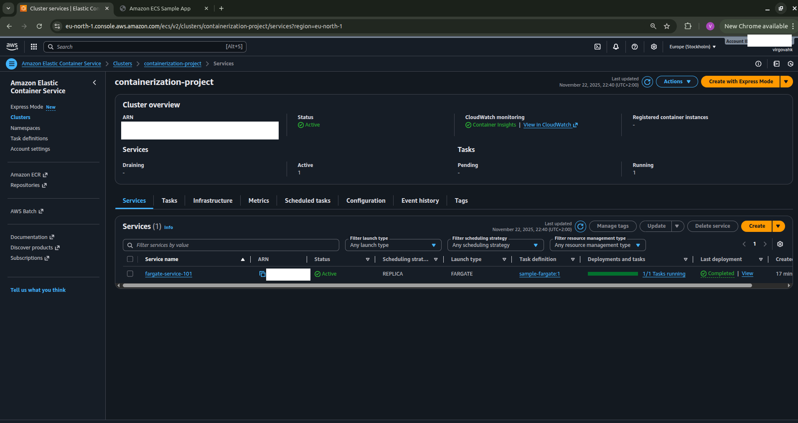
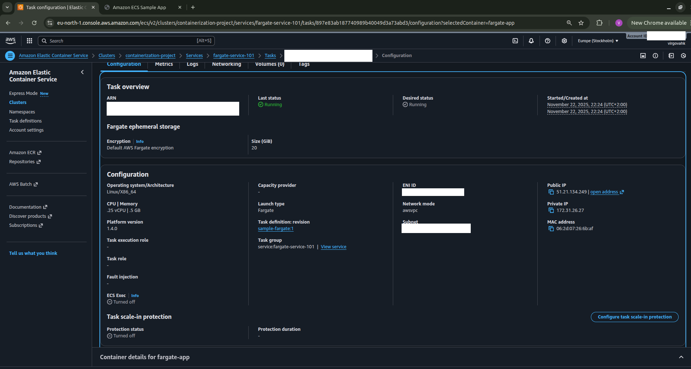
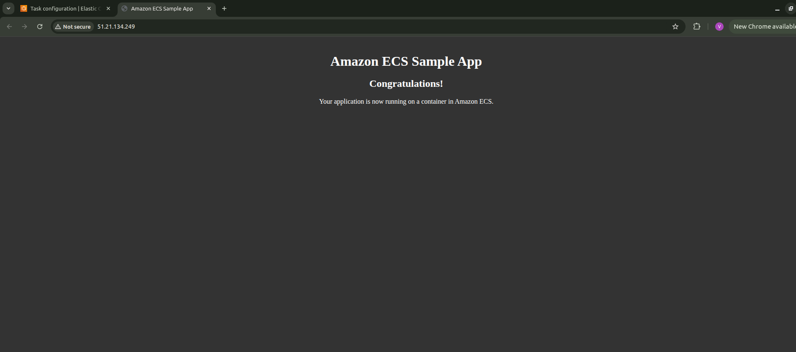
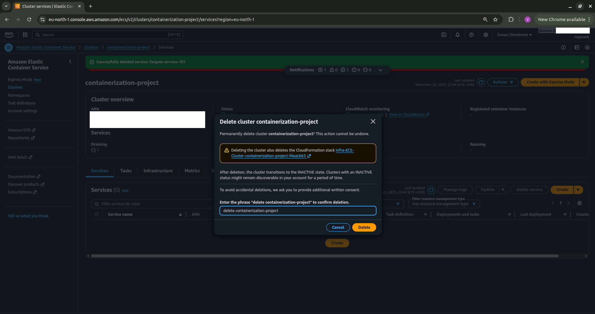

# Containers 101 - Deploying with AWS Fargate

## Project Overview
A containerized web application running on AWS ECS using Fargate. Deployed a sample application that was accessible via a public IP.

## Steps Taken
1. Created a ECS Cluster
2. Created a task definition
- Imported a JSON file with pre-configured settings
3. Created a Service in the cluster
- Launch type: Fargate
- Desired tasks: 1
- Configured a new security group to allow HTTP access.
4. Accessed the deployed application.

## AWS Services Used
- Amazon ECS
- AWS Fargate

## What I Learned
- What containerization is and why its used.
- Container concepts (clusters, tasks, services)
- Importance of security groups for container networking
- What a task definition is
- How modern applications use containerized microservices

## Resource Cleanup
✅ Service deleted
✅ Cluster deleted  
✅ Task definition deregistered

## Screenshots
### ECS Cluster Dashboard

*Cluster showing active service and running task*

### Task Configuration

*Fargate task configuration with public IP and resource allocation*

### Running Application

*Successfully deployed containerized application*

### Resource Cleanup Confirmation

*To show that I delete resources after done*

## Date
November 22, 2025